# Глава 3: Программирование механизмов внимания

<br/>

[](https://www.youtube.com/watch?v=-Ll8DtpNtvk)

<br/>

### 3.3.1. Простой механизм самовнимания без обучаемых весов

Цель механизма самовнимания — вычислить контекстный вектор для каждого входного элемента, который объединяет информацию из всех остальных входных элементов.

<br/>

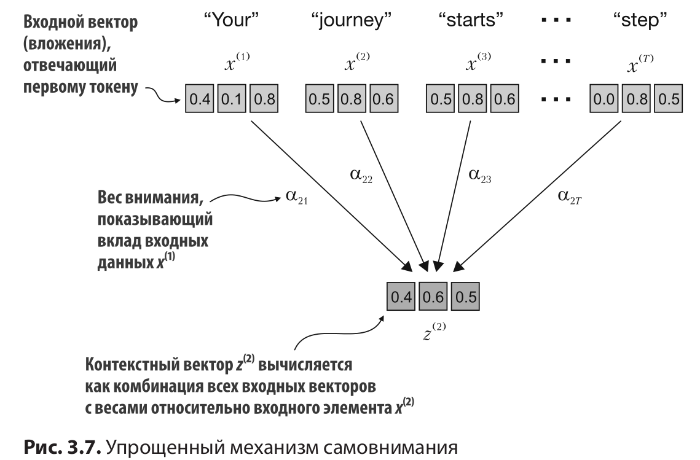

Контекстный вектор вычислим ближе к концу параграфа.

<br/>

Текст, был преобразован во вложенные токены.

```python
import torch
inputs = torch.tensor(
  [
  [0.43, 0.15, 0.89],  # Your     (x^1)
  [0.55, 0.87, 0.66],  # journey  (x^2)
  [0.57, 0.85, 0.64],  # starts   (x^3)
  [0.22, 0.58, 0.33],  # with     (x^4)
  [0.77, 0.25, 0.10],  # one      (x^5)
  [0.05, 0.80, 0.55]   # step     (x^6)
  ]
)
```

<br/>

Входной вектор округлили в меньшую сторону, чтобы было понятно. Но вычисления продолжаем с использованием сотых.

<br/>

```python
inputs = torch.tensor(
  [
  [0.4, 0.1, 0.8], # Your    (x^1)
  [0.5, 0.8, 0.6], # journey (x^2)
  [0.5, 0.8, 0.6], # starts  (x^3)
  [0.2, 0.5, 0.3], # with    (x^4)
  [0.7, 0.2, 0.1], # one     (x^5)
  [0.0, 0.8, 0.5]  # step    (x^6)
  ]
)
```

<br/>

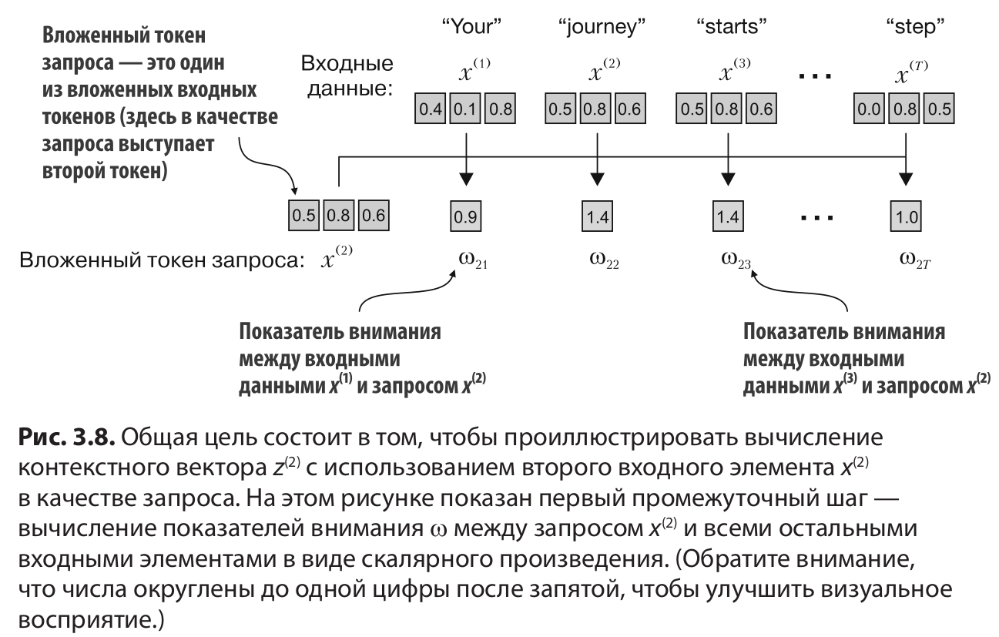

<br/>

1. Вложенный токен запроса - это второй входной вектор и у нас он [0.5, 0.8, 0.6]

2. Показатель внимания получается как скалярное произведение входного вектора на вложенный токен запроса.

<br/>

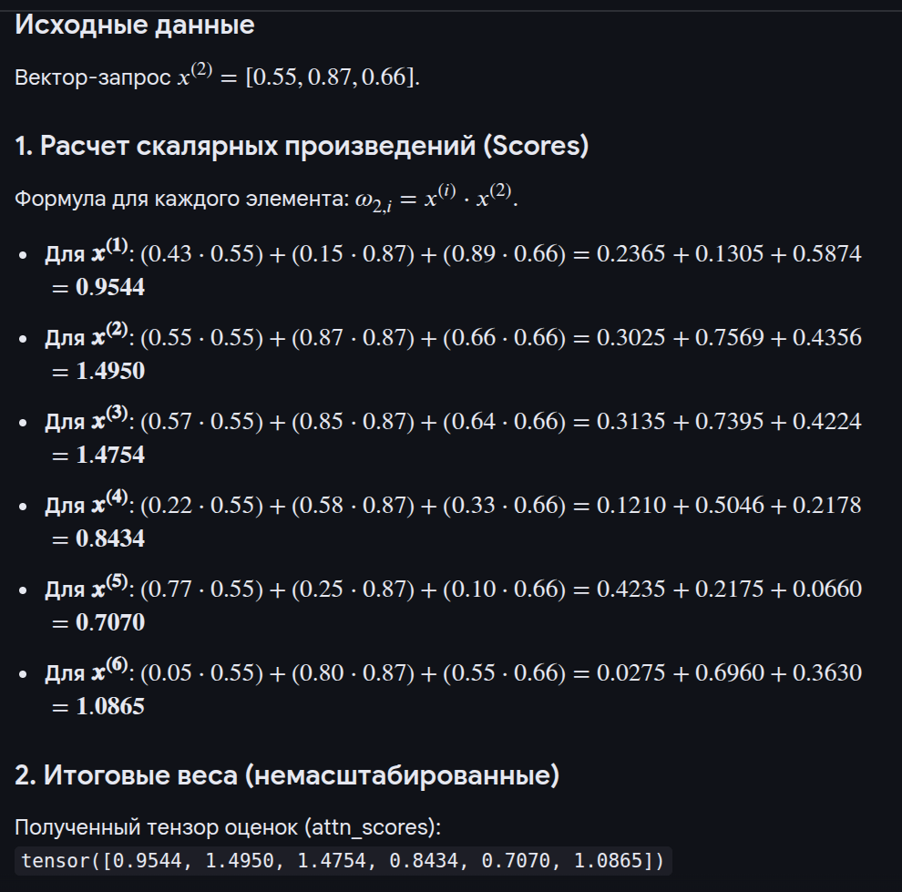

На рисунке их округлили в меньшую сторону.

<br/>

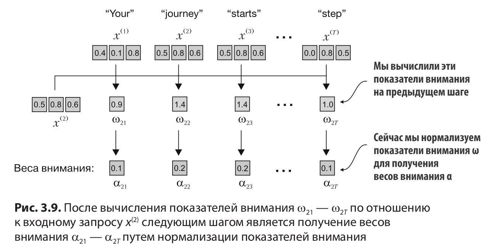

tensor([0.9544, 1.4950, 1.4754, 0.8434, 0.7070, 1.0865])

Округлили в меньшую сторону.

[0.9, 1.4, 1.4, 0.8, 0.7, 1.0]

<br/>

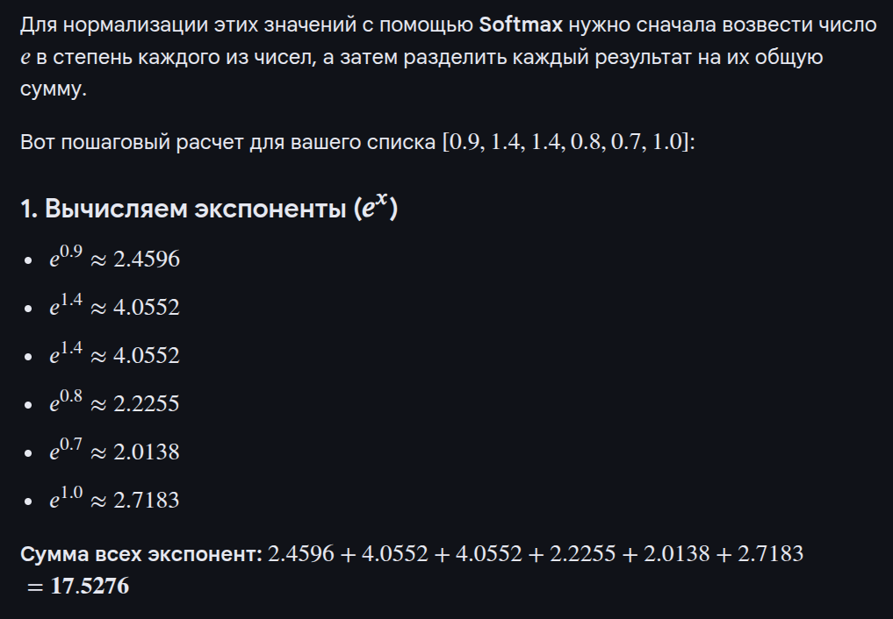

<br/>

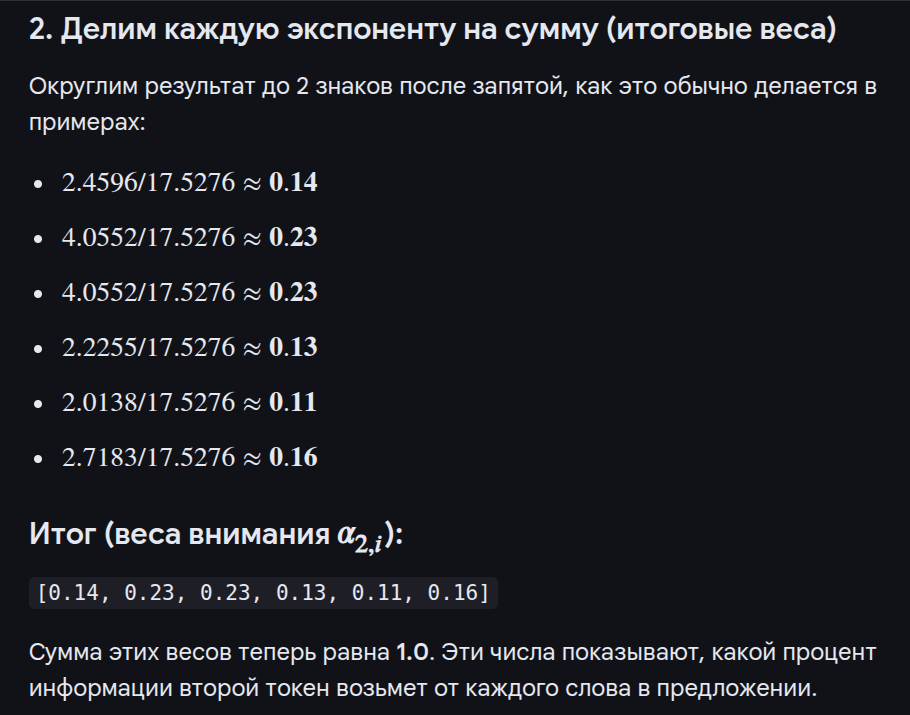

<br/>

```shell
>>> 0.14+0.23+0.23+0.13+0.11+0.16
1.0
```

В книге получилось:

tensor([0.1385, 0.2379, 0.2333, 0.1240, 0.1082, 0.1581])

Округлили в меньшую сторону для картинки

[0.1, 0.2, 0.2, 0.1, 0.1, 0.1]

<br/>

**Ищем Контекстный вектор**

<br/>

<br/>
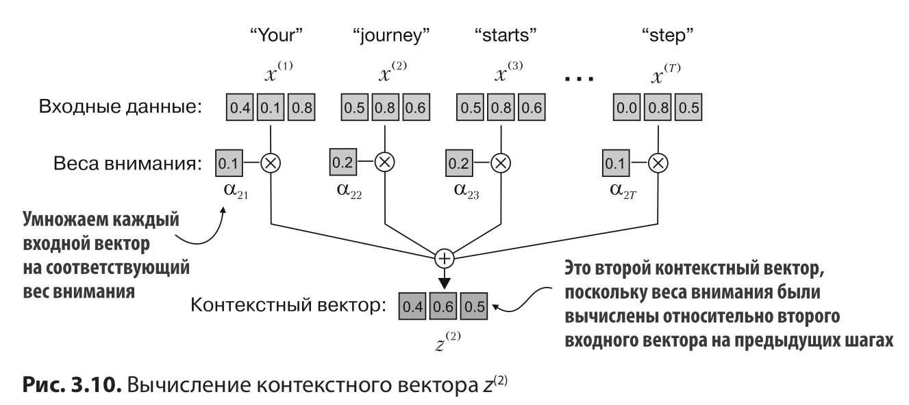

Контекстный вектор z(2) — это взвешенная сумма всех входных векторов от x(1) до x(T), полученная путем умножения каждого входного вектора на соответствующий вес внимания

<br/>

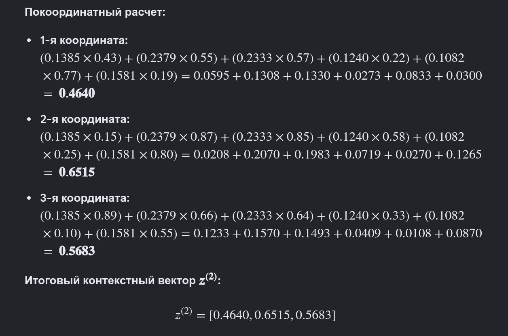

<br/>

Итоговый контекстный вектор. (Где, что окруляли, не так важно)  
[0.4640,0.6515,0.5683]

<br/>

### 3.3.2. Вычисление весов внимания для всех входных токенов

До сих пор мы вычисляли весовые коэффициенты внимания и контекстный вектор для одного входного токена.

<br/>

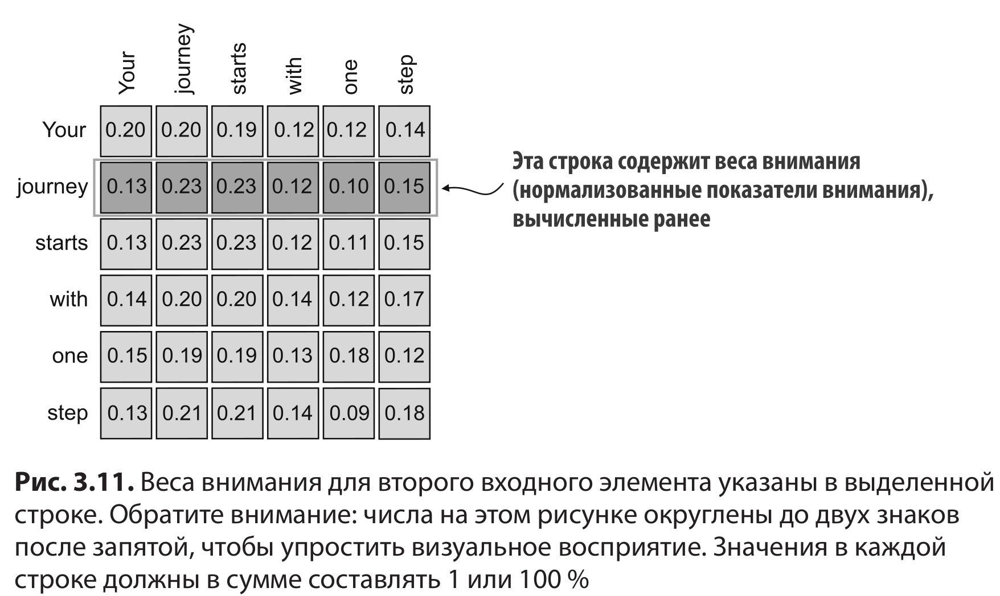

<br/>

Теперь расширим эти вычисления, чтобы вычислить веса внимания и контекстные векторы для всех входных токенов.

<br/>

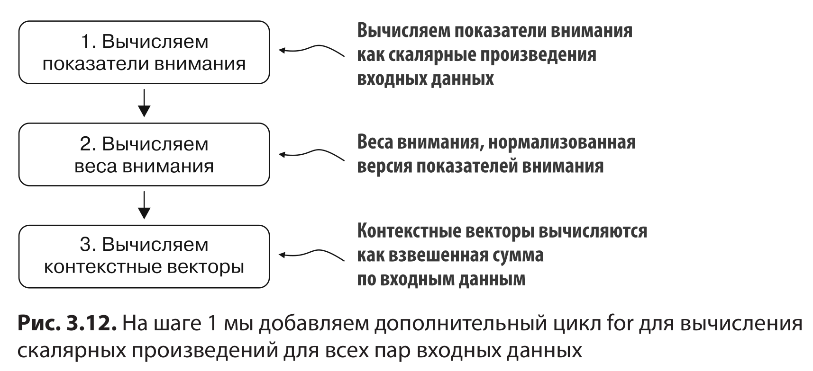

<br/>

Окончательные показатели внимания выглядят так:

<br/>

```
tensor([[0.9995, 0.9544, 0.9422, 0.4753, 0.4576, 0.6310],
        [0.9544, 1.4950, 1.4754, 0.8434, 0.7070, 1.0865],
        [0.9422, 1.4754, 1.4570, 0.8296, 0.7154, 1.0605],
        [0.4753, 0.8434, 0.8296, 0.4937, 0.3474, 0.6565],
        [0.4576, 0.7070, 0.7154, 0.3474, 0.6654, 0.2935],
        [0.6310, 1.0865, 1.0605, 0.6565, 0.2935, 0.9450]]
)
```

<br/>

Получаем следующий тензор весов внимания со значениями:

<br/>

```
tensor([[0.2098, 0.2006, 0.1981, 0.1242, 0.1220, 0.1452],
        [0.1385, 0.2379, 0.2333, 0.1240, 0.1082, 0.1581],
        [0.1390, 0.2369, 0.2326, 0.1242, 0.1108, 0.1565],
        [0.1435, 0.2074, 0.2046, 0.1462, 0.1263, 0.1720],
        [0.1526, 0.1958, 0.1975, 0.1367, 0.1879, 0.1295],
        [0.1385, 0.2184, 0.2128, 0.1420, 0.0988, 0.1896]]
)
```

<br/>

На финальном шаге, мы используем эти веса внимания
для вычисления всех контекстных векторов через перемножение матриц:

<br/>

В результирующем тензоре каждая строка содержит трехмерный контекстный вектор:

<br/>

```
tensor([[0.4421, 0.5931, 0.5790],
        [0.4419, 0.6515, 0.5683],
        [0.4431, 0.6496, 0.5671],
        [0.4304, 0.6298, 0.5510],
        [0.4671, 0.5910, 0.5266],
        [0.4177, 0.6503, 0.5645]]
)
```

<br/>

## 3.4. Реализация самовнимания с обучаемыми весами

<br/>

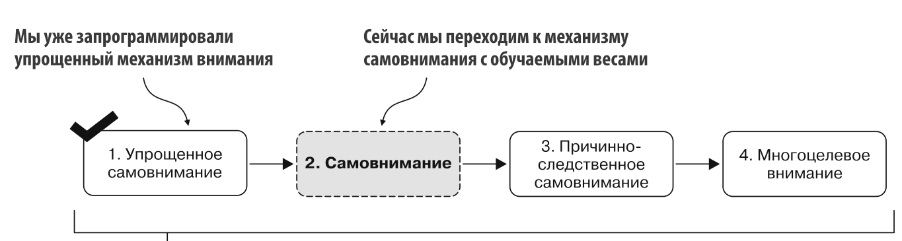

<br/>

## 3.4.1. Пошаговое вычисление весовых коэффициентов внимания

Мы реализуем механизм самовнимания пошагово, вводя три обучаемые весовые матрицы Wq, Wk и Wv. Они используются для проецирования вложенных входных токенов x(i) на векторы запроса, векторы ключей и векторы значений
соответственно.

<br/>

- Wq - векторы запроса
- Wk - векторы ключей
- Wv - векторы значений

```python
import torch
inputs = torch.tensor(
  [
  [0.43, 0.15, 0.89],  # Your     (x^1)
  [0.55, 0.87, 0.66],  # journey  (x^2)
  [0.57, 0.85, 0.64],  # starts   (x^3)
  [0.22, 0.58, 0.33],  # with     (x^4)
  [0.77, 0.25, 0.10],  # one      (x^5)
  [0.05, 0.80, 0.55]   # step     (x^6)
  ]
)
```

<br/>

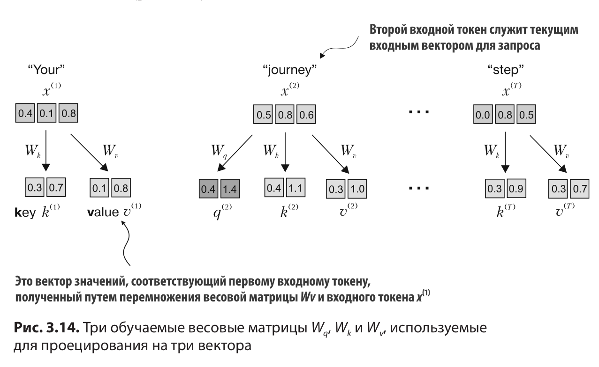

<br/>

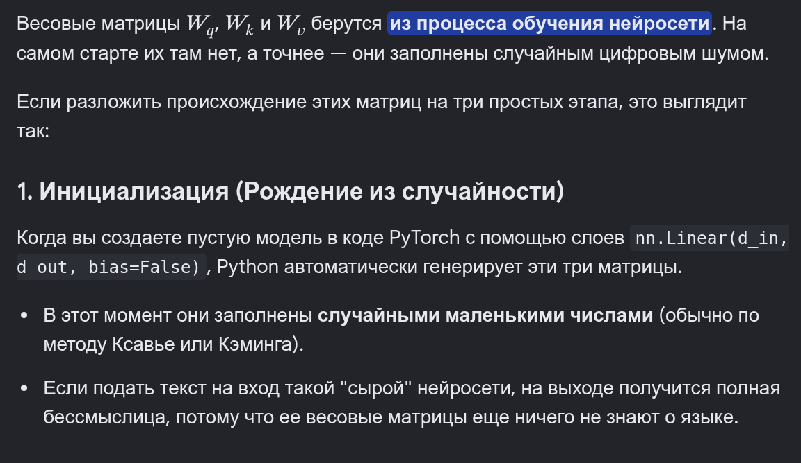

<br/>

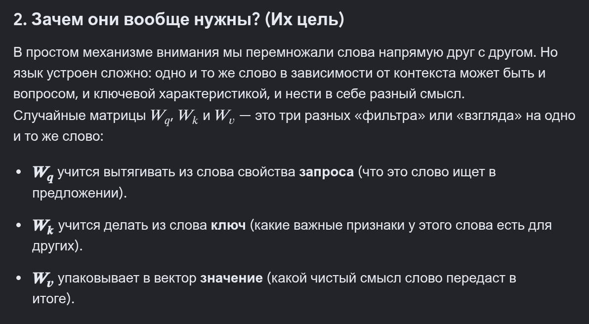

<br/>

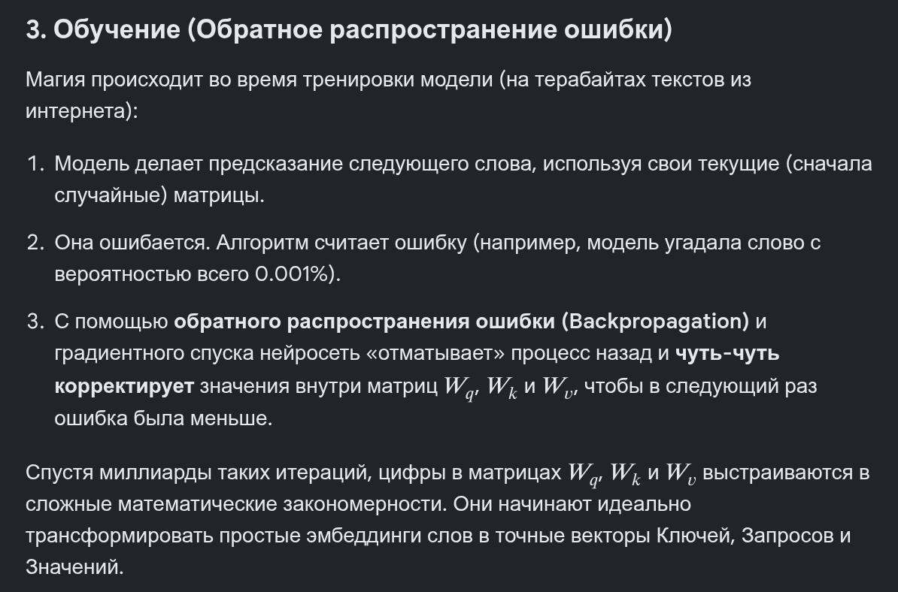

<br/>

На первом шаге механизма самовнимания с обучаемыми весовыми матрицами мы вычисляем векторы запроса (q), векторы ключей (k) и векторы значений (v) для входных элементов x.

Как и в предыдущих разделах, мы обозначаем второй входной элемент x(2) как запрос.

Вектор запроса q(2) получается путем умножения входного элемента x(2) на весовую матрицу Wq. Аналогичным образом мы получаем векторы ключей и значений, умножая входной элемент x(2) на весовые
матрицы Wk и Wv.

Ранее мы определили второй входной элемент x(2) в качестве запроса, когда вычисляли упрощенные веса внимания и контекстного вектора z(2). Затем мы распространили данный подход на вычисление всех контекстных векторов z(1)... z(T) для входного предложения из шести слов Your journey starts with one step.

<br/>

Второй шаг — вычислить показатели внимания

<br/>

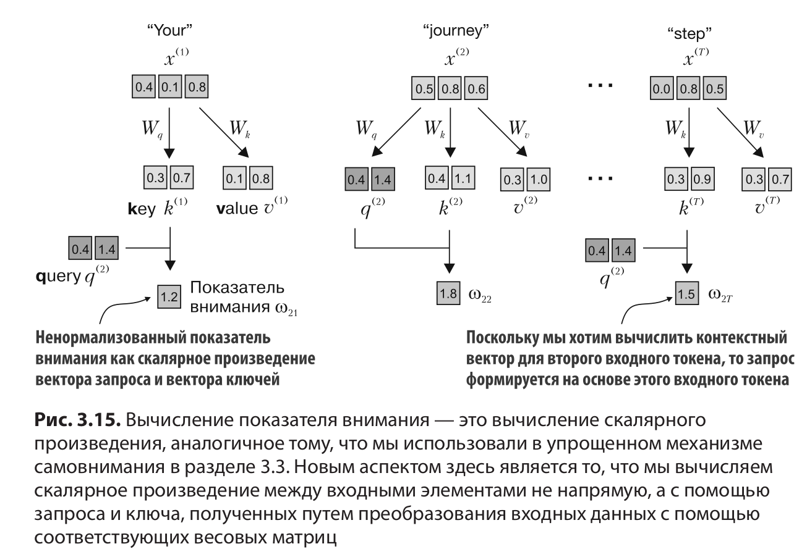

<br/>

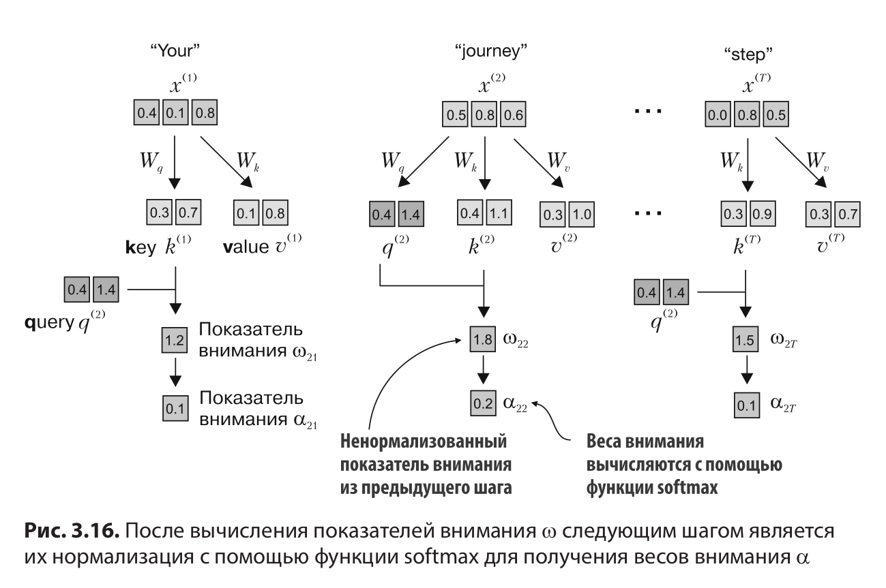

<br/>

Последний шаг — вычислить контекстные векторы

<br/>

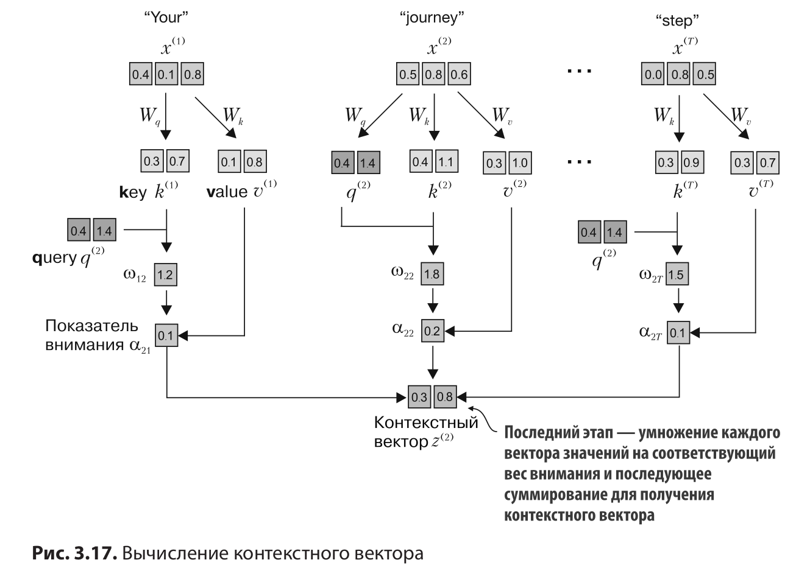

<br/>

### 3.4.2. Реализация компактного класса Python для самовнимания

<br/>

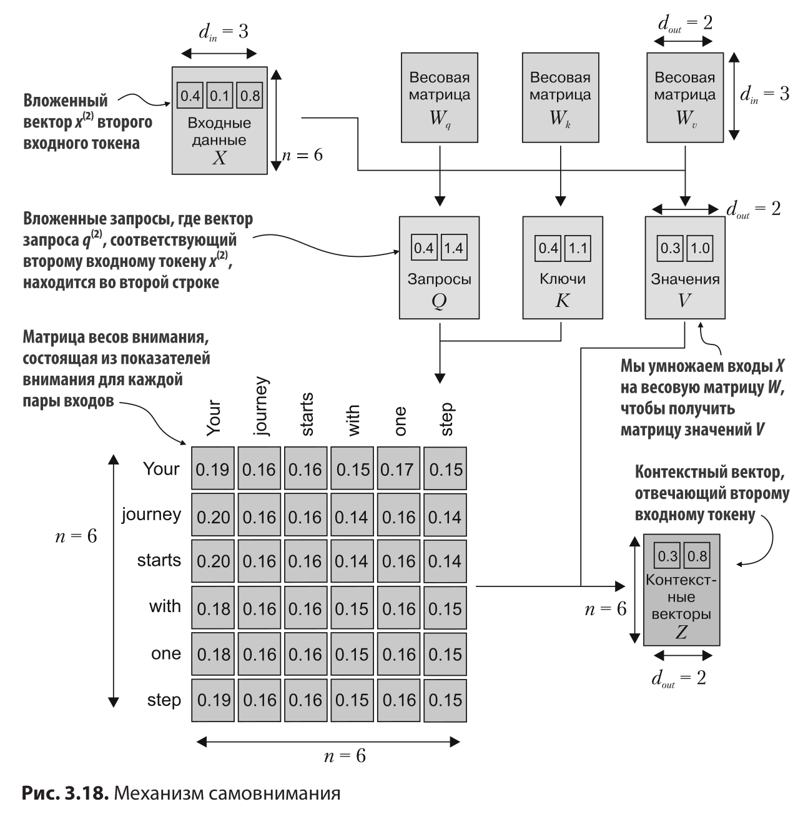

<br/>

Итак, самовнимание включает в себя обучаемые весовые матрицы Wq, Wk и Wv. Они преобразуют входные данные в запросы, ключи и значения соответственно,

<br/>

### 3.5. Сокрытие будущих слов с помощью причинно-следственного внимания

<br/>

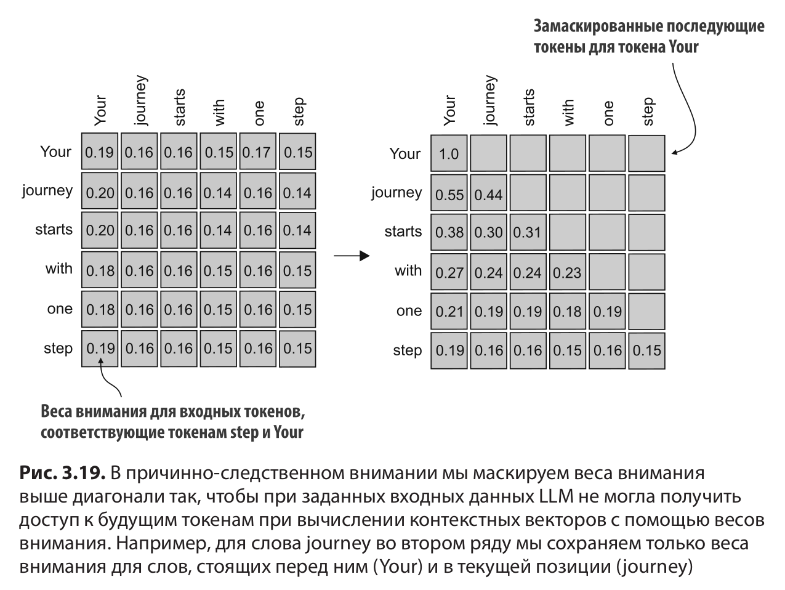

<br/>

### 3.5.1. Применение маски причинно-следственного внимания

<br/>

### 3.5.2. Маскирование дополнительных весов внимания с помощью отсева (dropout)

Отсев (dropout) в глубоком обучении — это метод, при котором случайно выбранные элементы скрытого слоя игнорируются во время обучения, фактически «будучи отсеянными». Данный метод помогает предотвратить переобучение, гарантируя, что модель не будет чрезмерно полагаться на какой-либо конкретный набор элементов скрытого слоя. Важно подчеркнуть, что отсев используется
только во время обучения и отключается после него.

<br/>

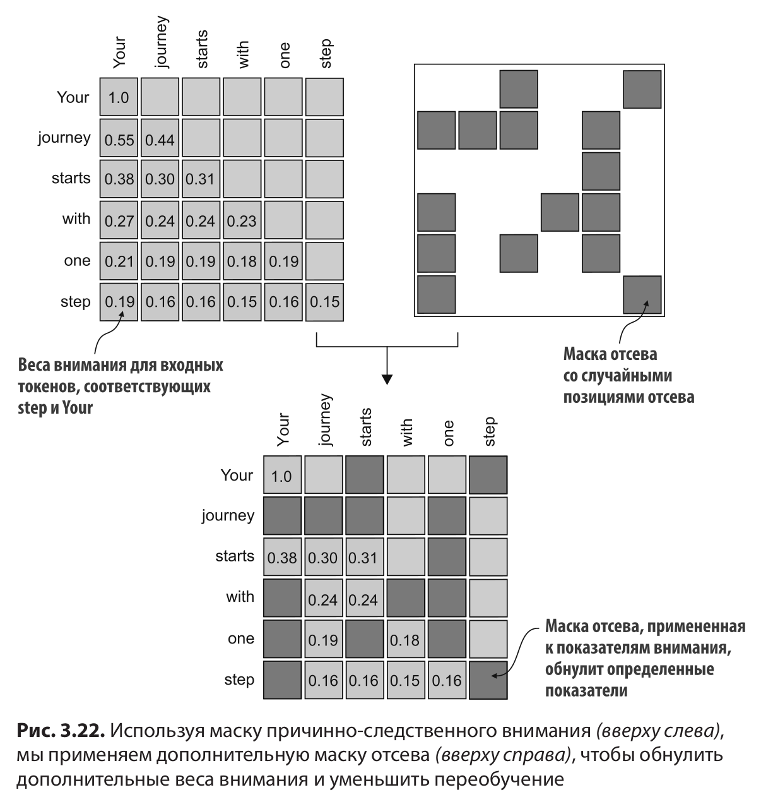

<br/>

При применении отсева к матрице весов внимания с частотой 50 % половина элементов матрицы случайным образом устанавливается в нулевое значение.
Чтобы компенсировать уменьшение количества активных элементов, значения оставшихся элементов матрицы увеличиваются в 1 / 0,5 = 2 раза.

<br/>

### 3.6. Расширение одноцелевого внимания до многоцелевого

<br/>

### 3.6.1. Объединение нескольких одноцелевых слоев внимания

<br/>

Основная идея многоцелевого внимания заключается
в том, чтобы запускать механизм внимания несколько раз (параллельно) с разными изученными линейными проекциями — результатами умножения входных данных на весовую матрицу.

<br/>

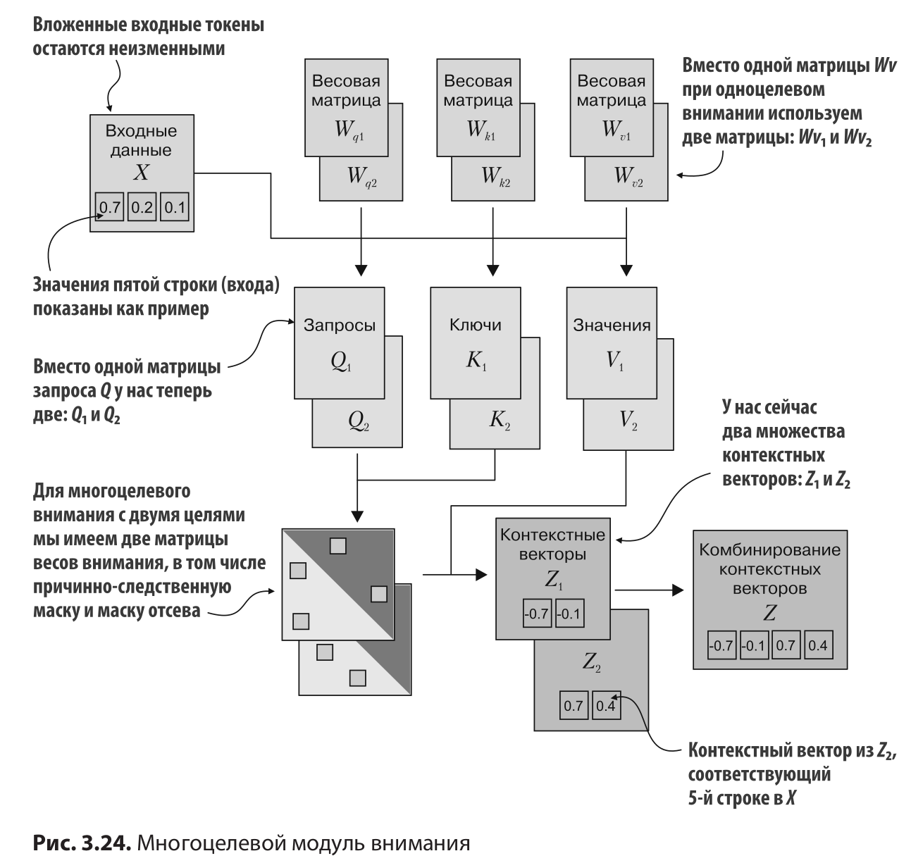

<br/>

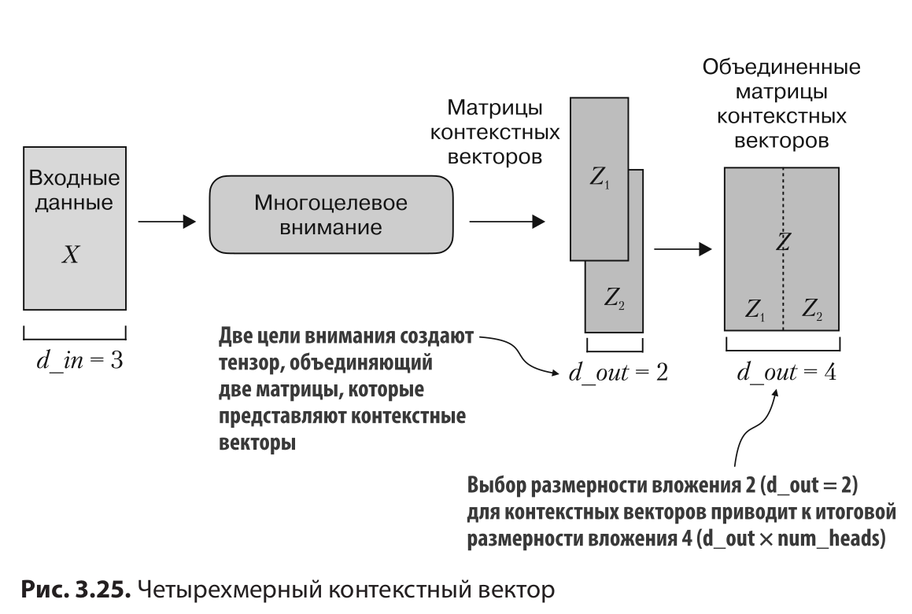

<br/>

### 3.6.2. Реализация многоцелевого внимания с разделением весов

<br/>

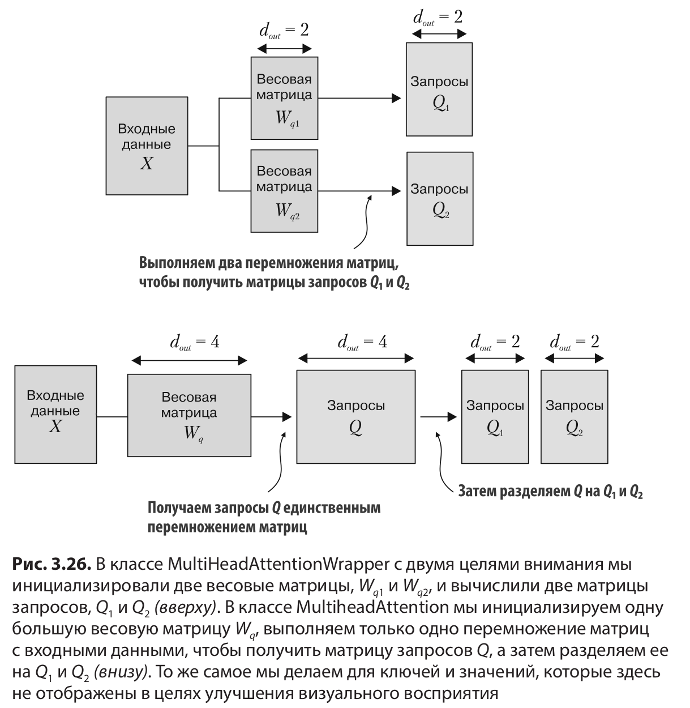
