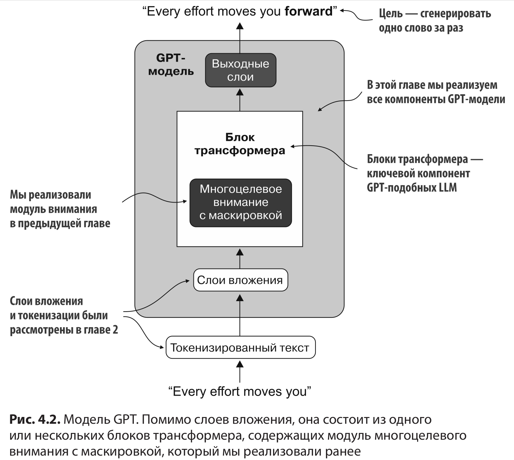
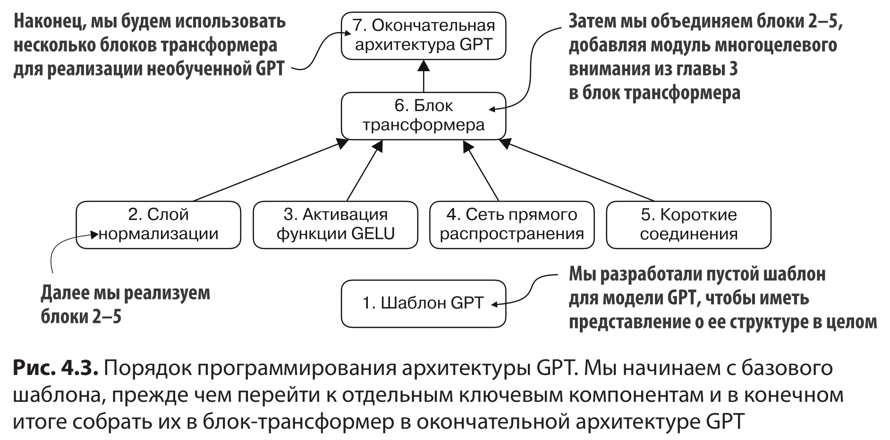
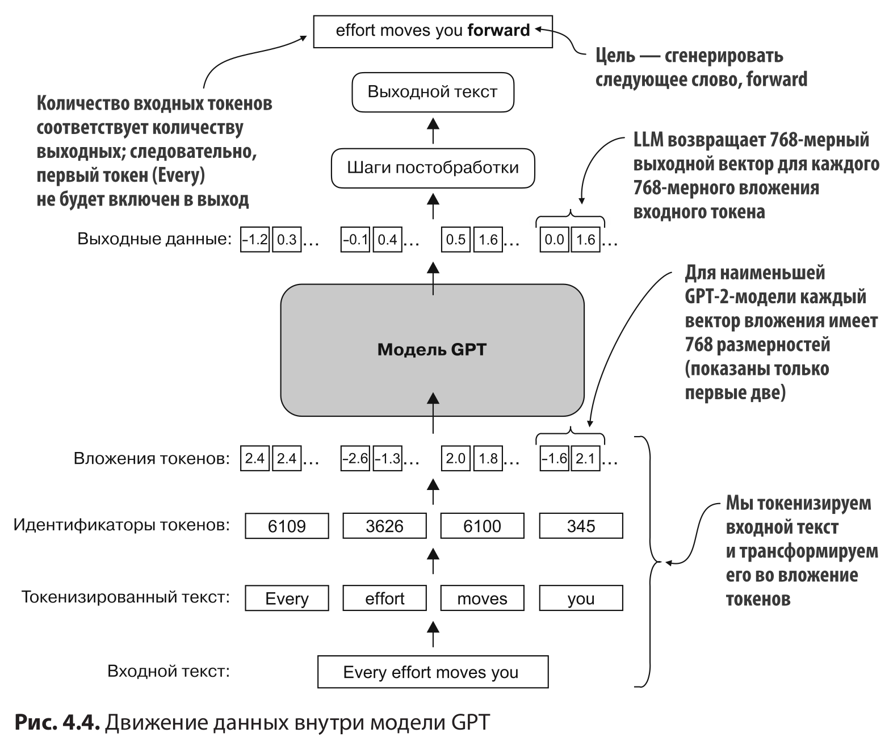
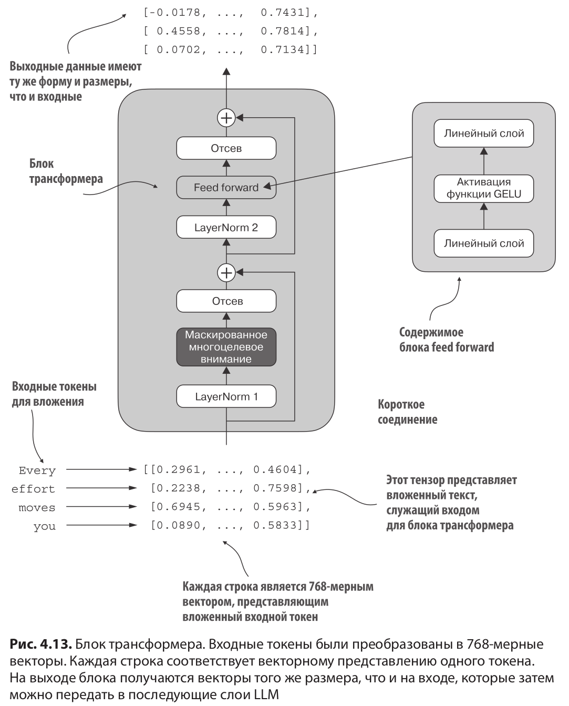

# Глава 4: Создание GPT-подобной модели для генерации текста с нуля

 

 

## 4.1. Программирование архитектуры LLM

 

 

 

 

### 4.2. Нормализация активаций с помощью нормализации слоев

 

### 4.5. Объединение механизма внимания и линейных слоев в блоке трансформера

 

 

### 4.6. Программирование модели GPT
