# Глава 5: Предварительное обучение на неразмеченных данных

&nbsp;

 

### 5.1. Оценка генеративных текстовых моделей

 

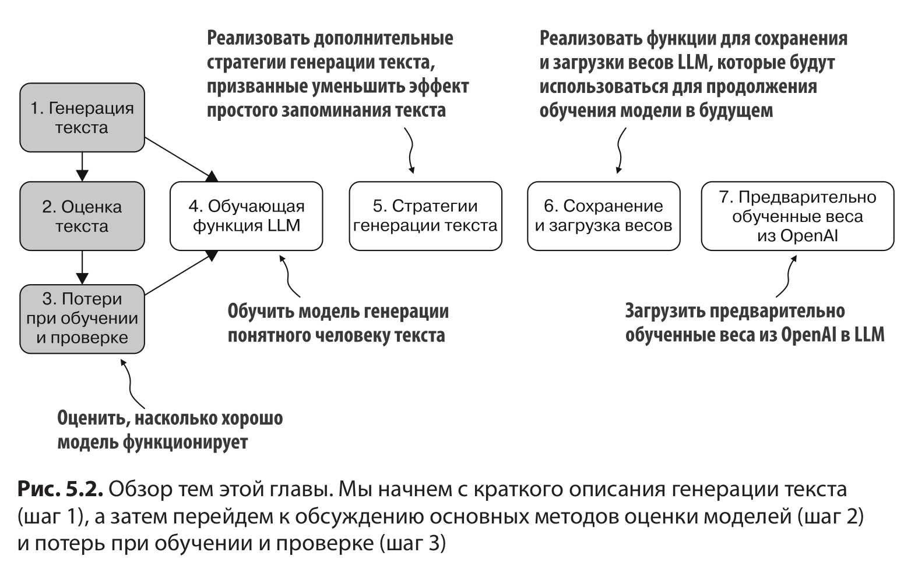

 

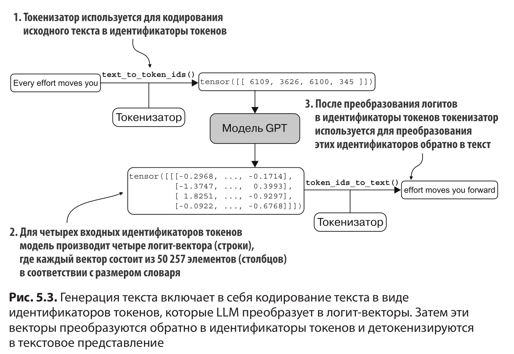

 

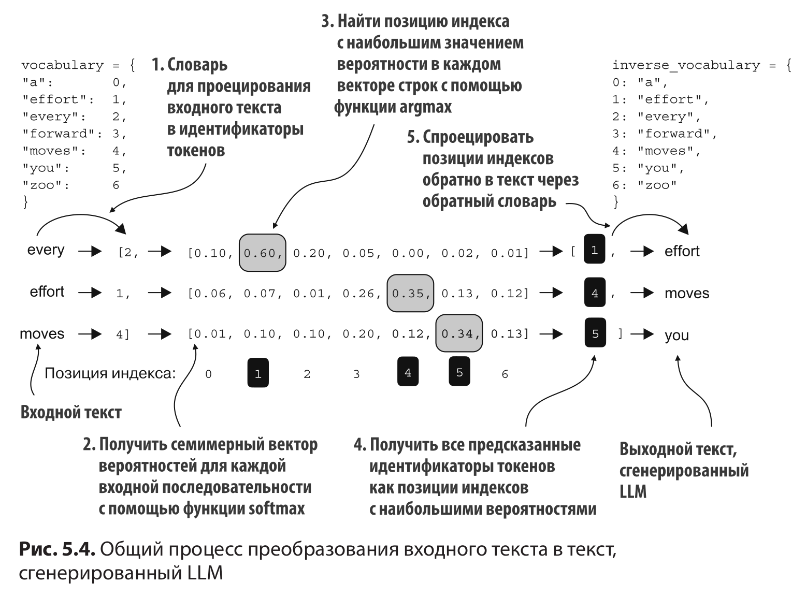

 

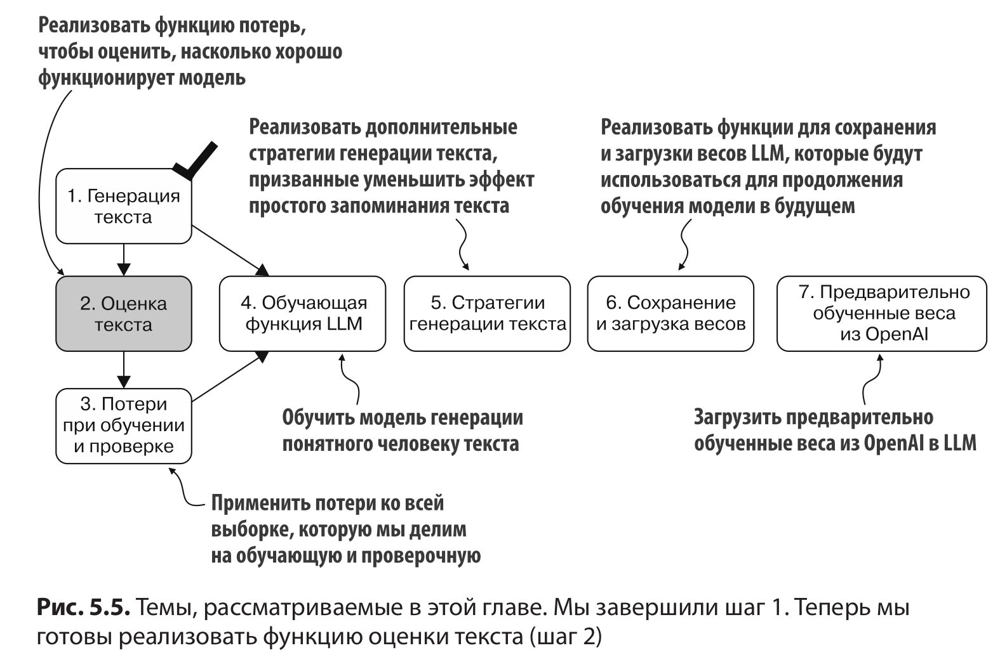

 

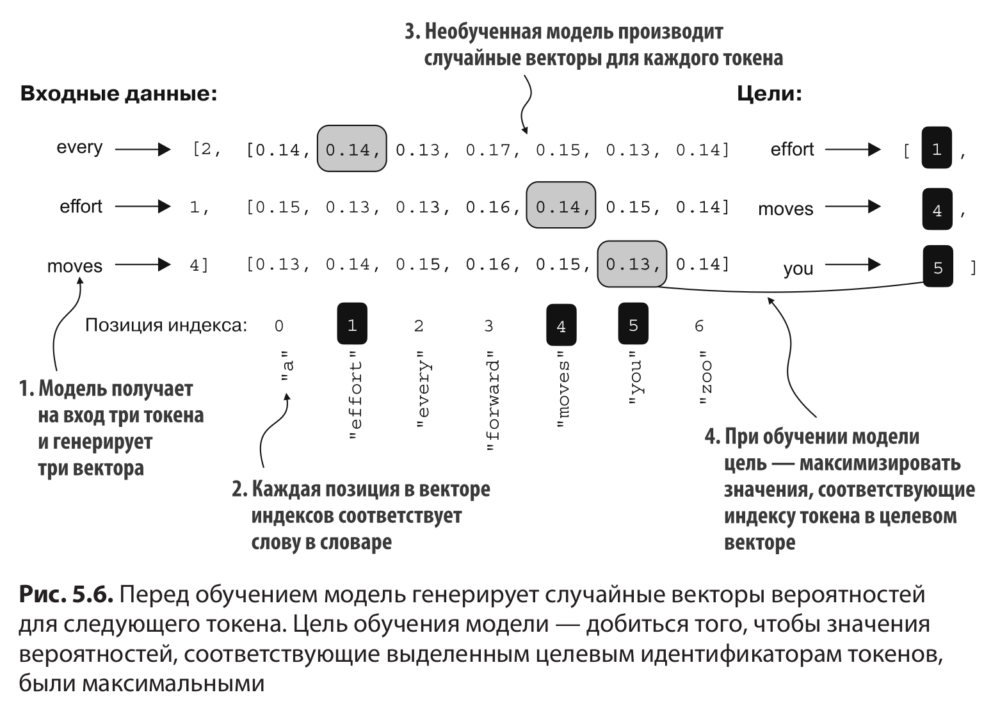

 

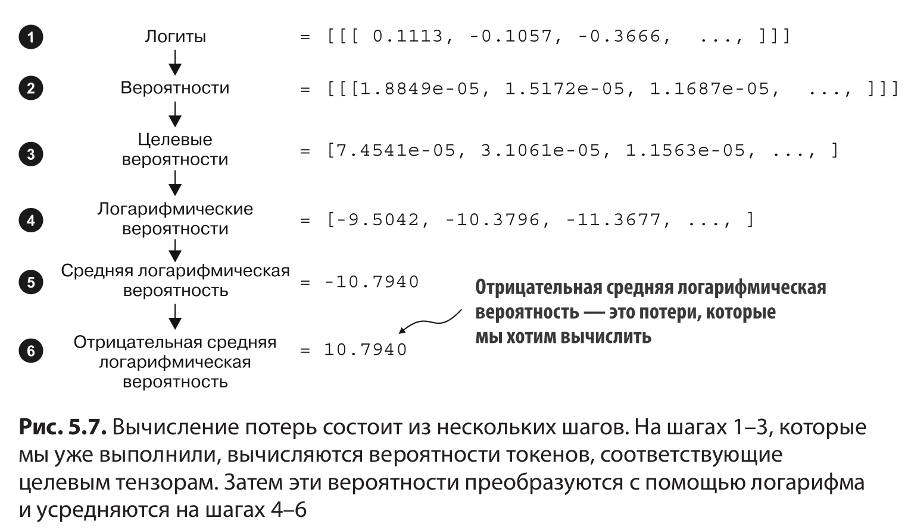

 

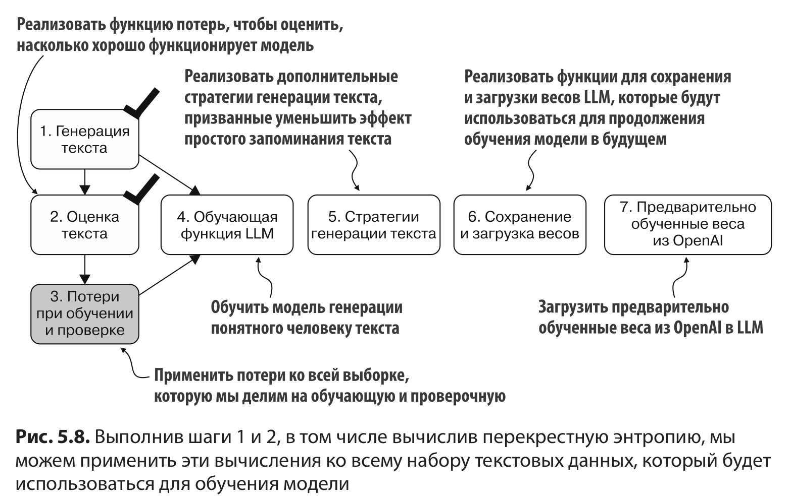

 

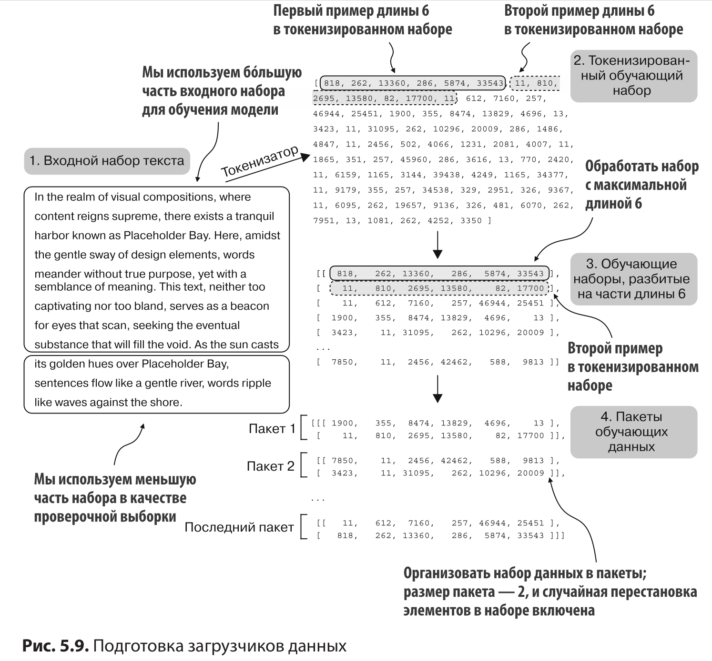

 

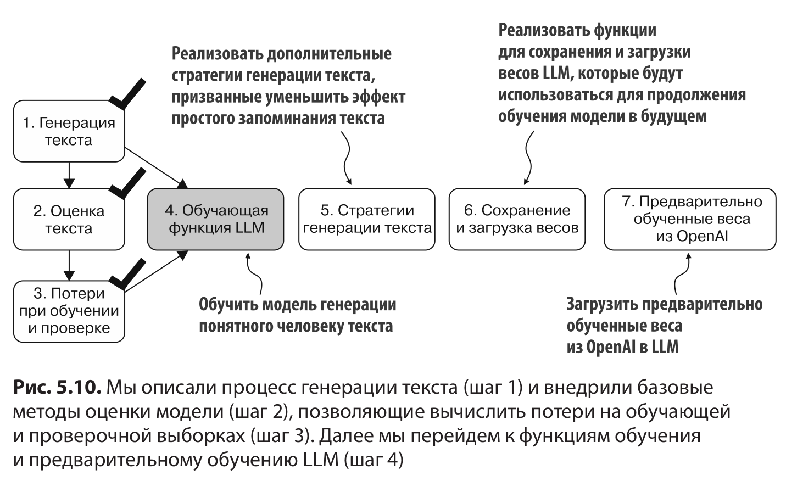

 

### 5.2. Обучение LLM

 

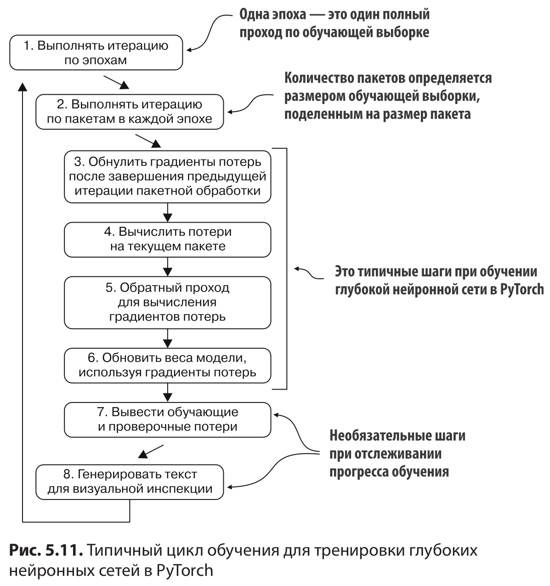

 

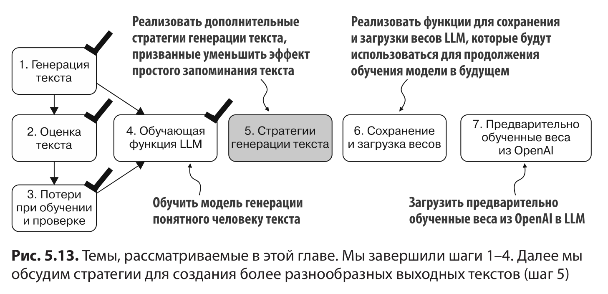

 

### 5.3. Стратегии декодирования для контроля случайности

 

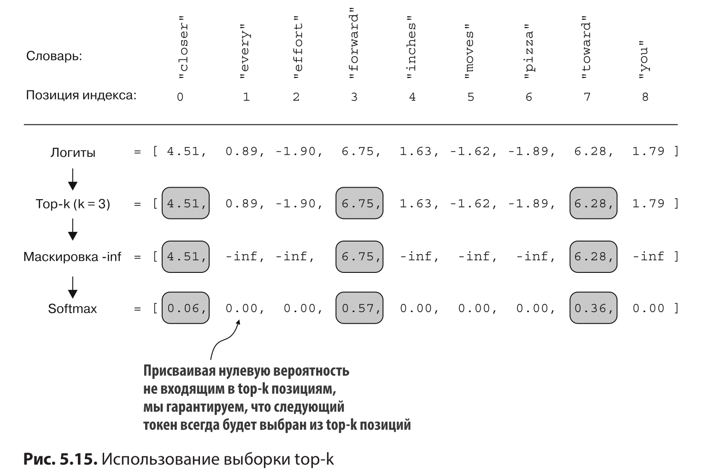

 

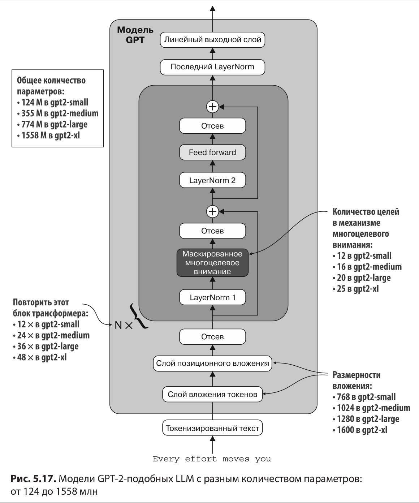

&nbsp;

### Main Chapter Code

- [ch05.ipynb](ch05.ipynb) contains all the code as it appears in the chapter
- [previous_chapters.py](previous_chapters.py) is a Python module that contains the `MultiHeadAttention` module and `GPTModel` class from the previous chapters, which we import in [ch05.ipynb](ch05.ipynb) to pretrain the GPT model
- [gpt_download.py](gpt_download.py) contains the utility functions for downloading the pretrained GPT model weights
- [exercise-solutions.ipynb](exercise-solutions.ipynb) contains the exercise solutions for this chapter

### Optional Code

- [gpt_train.py](gpt_train.py) is a standalone Python script file with the code that we implemented in [ch05.ipynb](ch05.ipynb) to train the GPT model (you can think of it as a code file summarizing this chapter)
- [gpt_generate.py](gpt_generate.py) is a standalone Python script file with the code that we implemented in [ch05.ipynb](ch05.ipynb) to load and use the pretrained model weights from OpenAI
