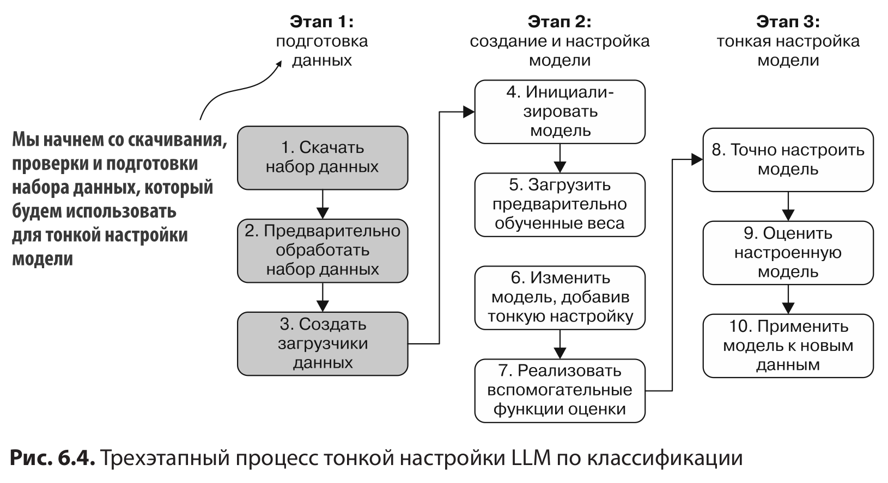
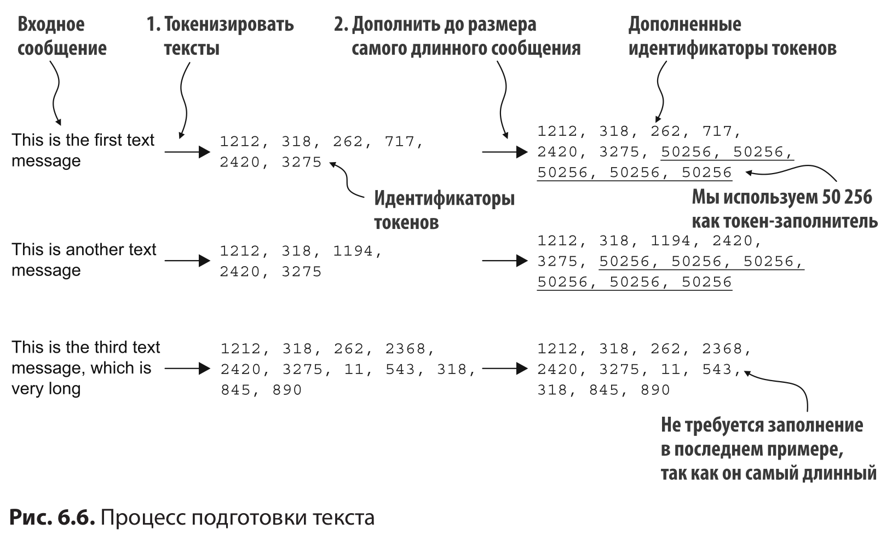
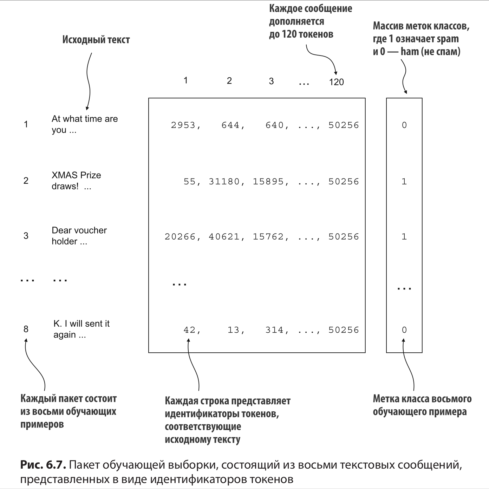
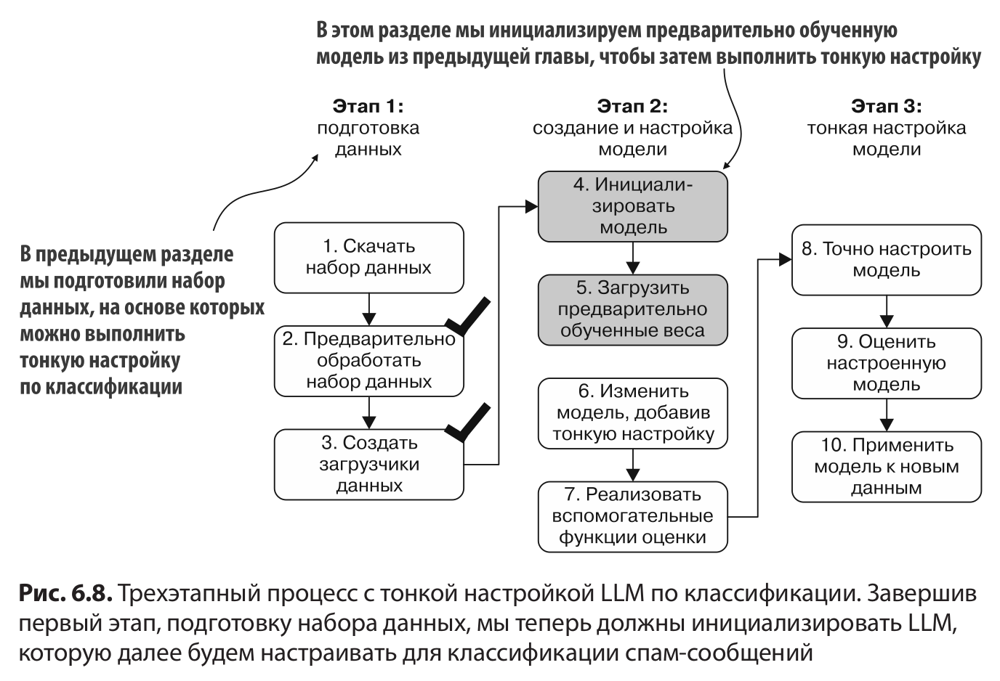
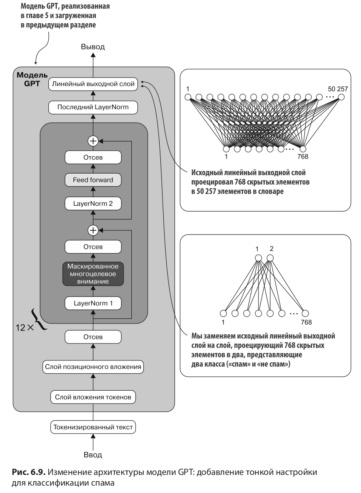
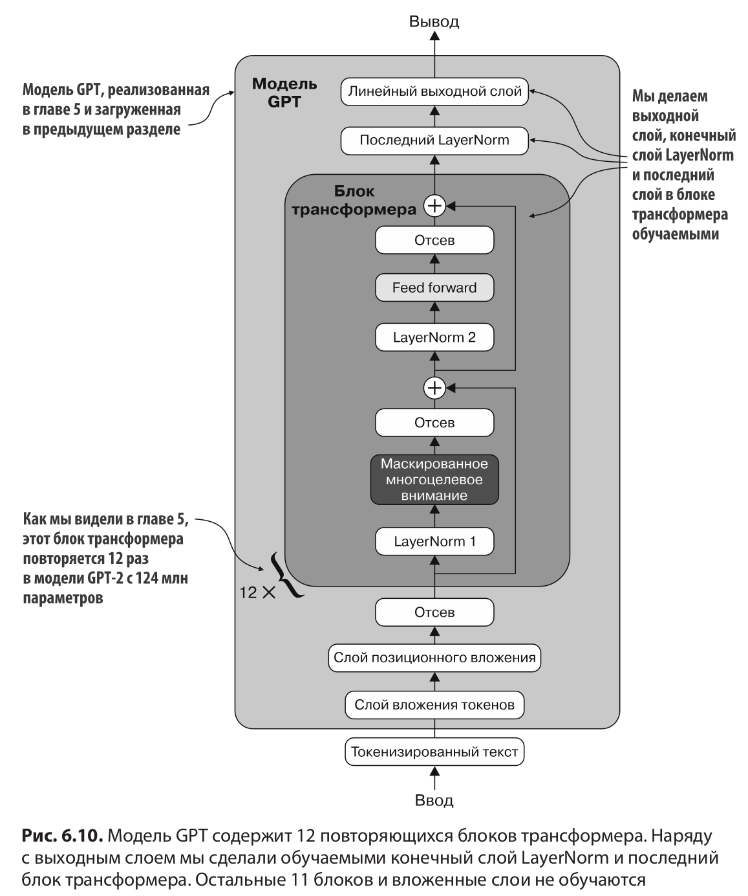
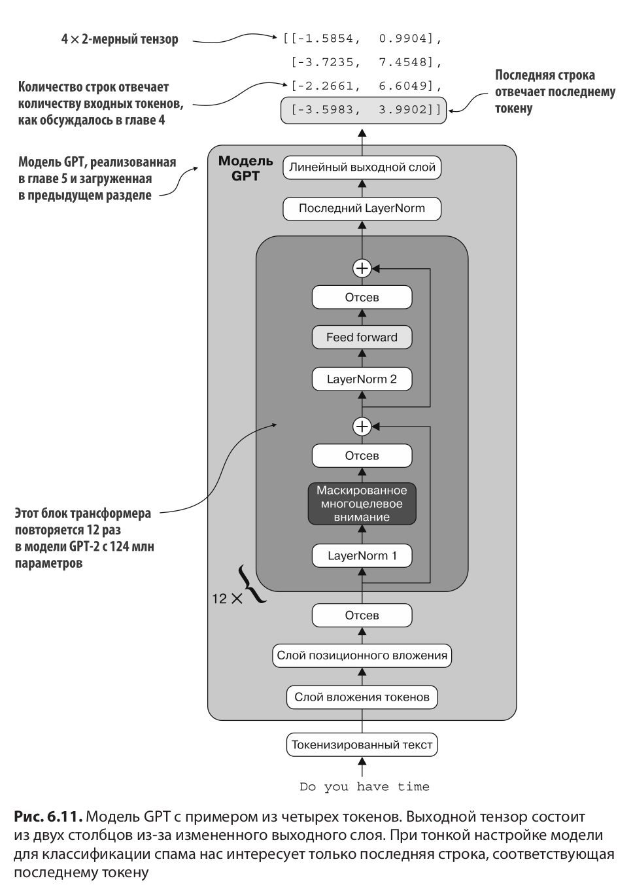
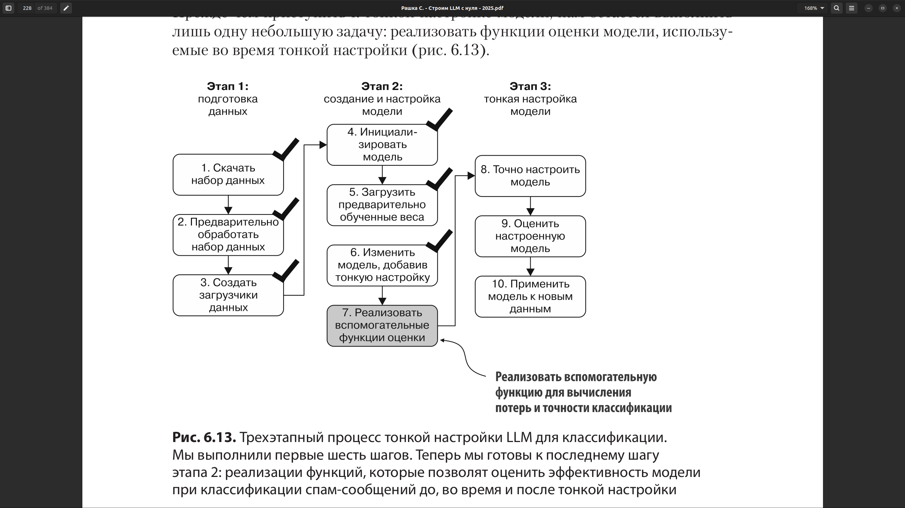
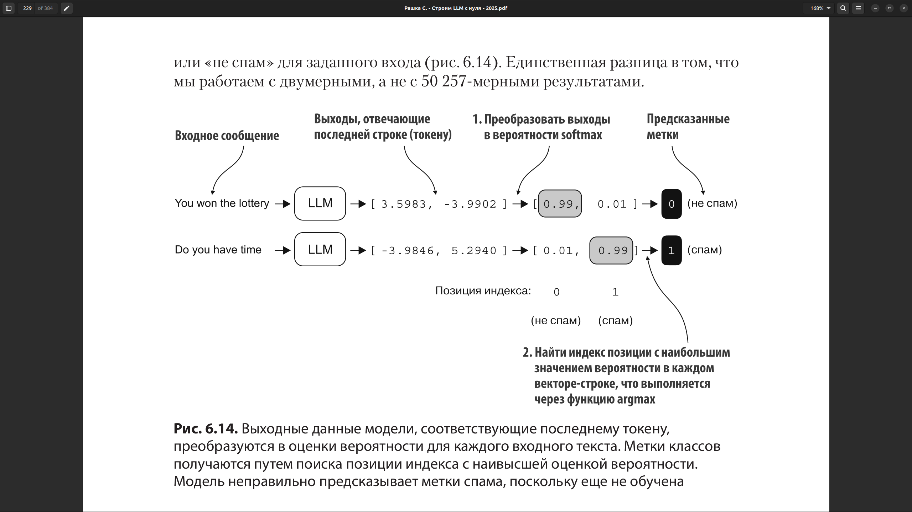
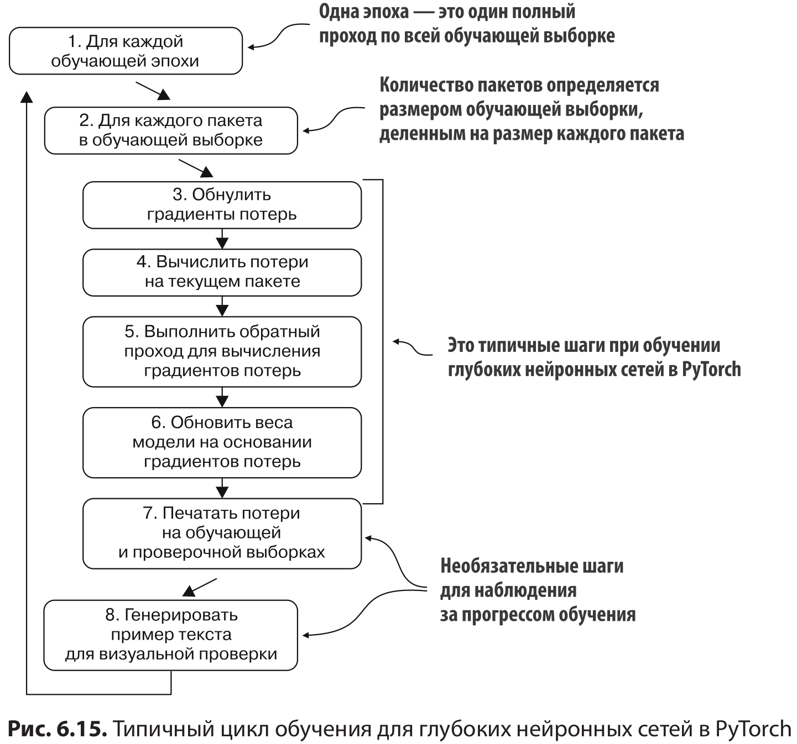

# Глава 6: Тонкая настройка по классификации

 

 

В данной главе мы изменим и дообучим модель GPT, которую ранее внедрили и предварительно обучили. Начнем со скачивания и подготовки набора данных. Чтобы вы могли увидеть наглядный и полезный пример дообучения по классификации, мы будем работать с набором текстовых сообщений, состоящим из спама и не спама.

 

 

 

 

### 6.4. Инициализация модели с предварительно обученными весами

Мы должны подготовить модель к тонкой настройке по классификации, чтобы распознавать спам-сообщения.

 

 

 

Мы добавили новый выходной слой и пометили некоторые слои как обучаемые или необучаемые, но по-прежнему можем использовать эту модель так же, как и раньше.

Однако размерность каждого выходного вектора (количество столбцов) теперь равна 2, а не 50 257, поскольку мы заменили выходной слой модели.

 

 

### 6.6. Расчет потерь и точности классификации

 

 

Точность предсказания близка к случайному, которое в данном случае составило бы 50 %. Чтобы повысить точность предсказания, нужно дообучить модель.

Однако прежде чем приступить к дообучению, мы должны определить функцию потерь, которую будем оптимизировать во время обучения.

 

### 6.7. Тонкая настройка модели на данных с метками

 

Тот же цикл обучения, который мы использовали для предварительного обучения. Единственное различие заключается в том, что мы
вычисляем точность классификации вместо того, чтобы генерировать текст для оценки модели.

 

