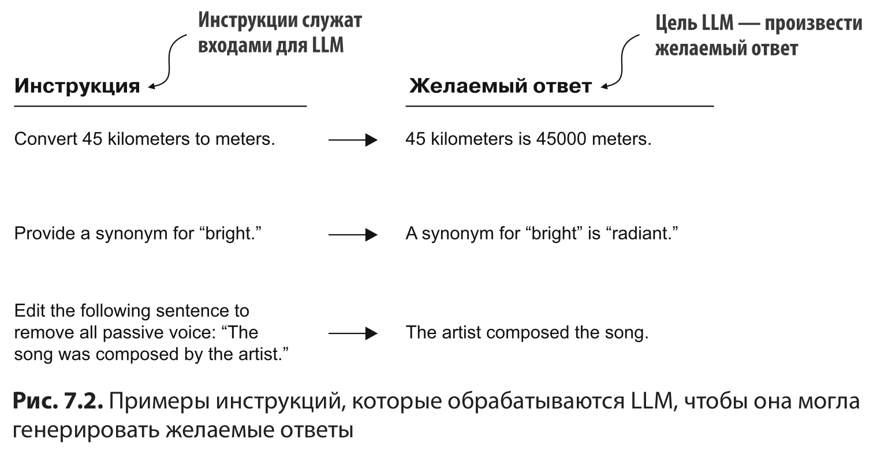
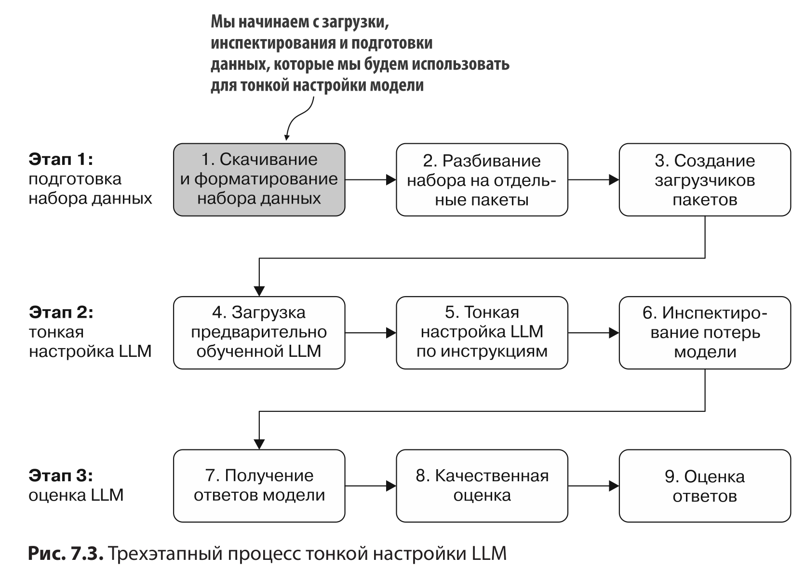
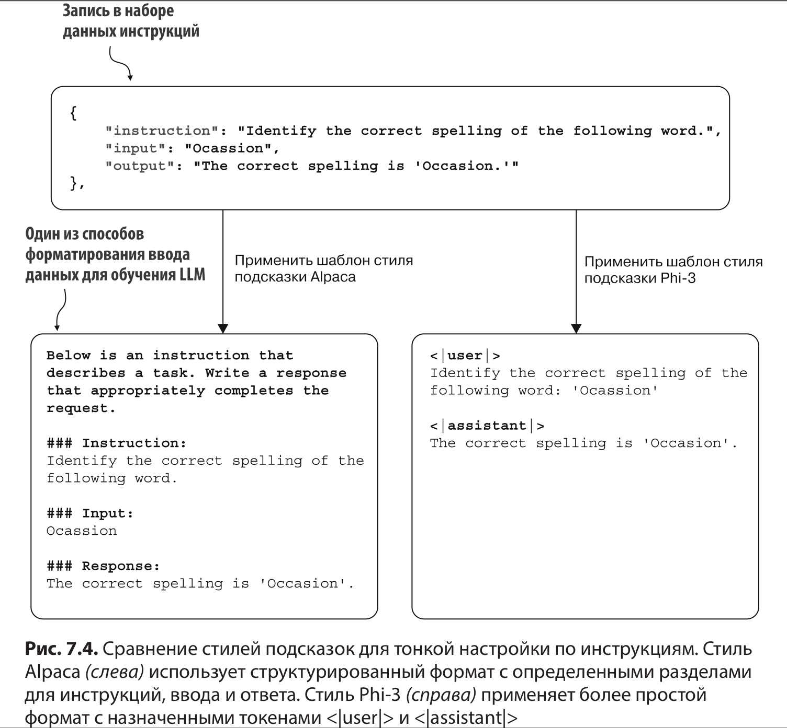
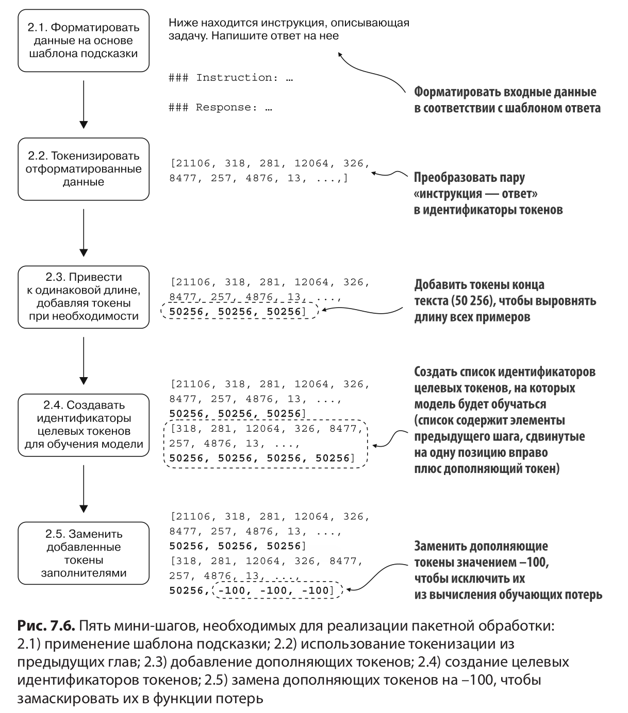
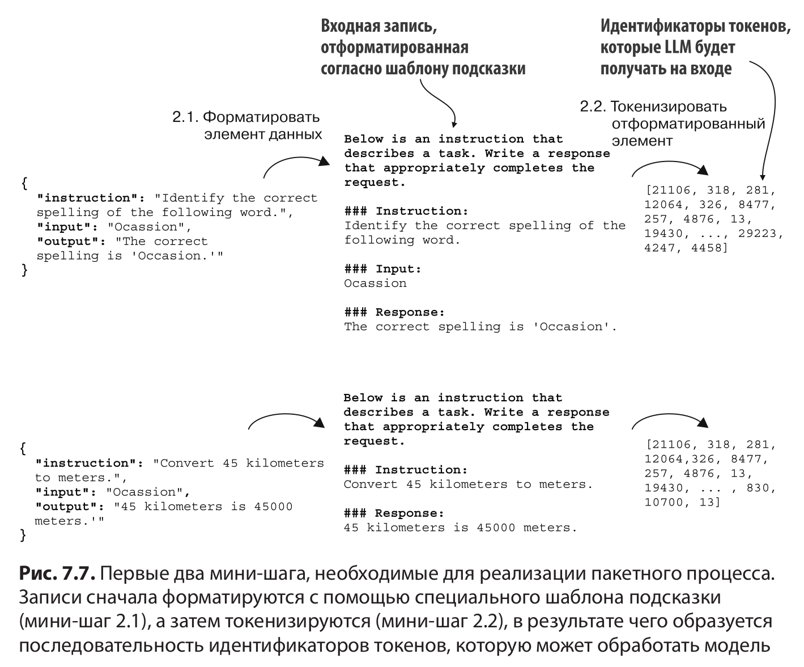
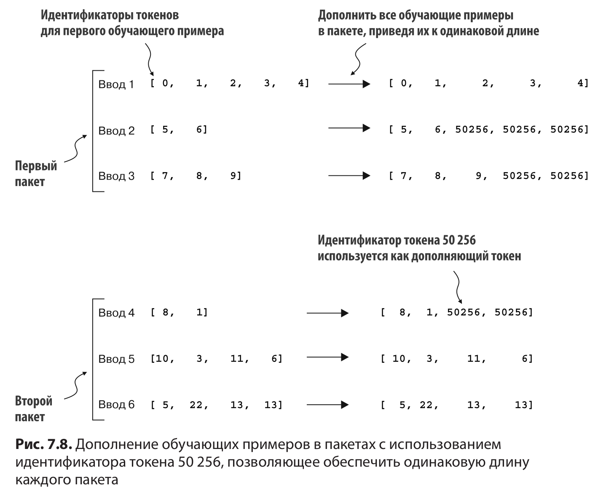
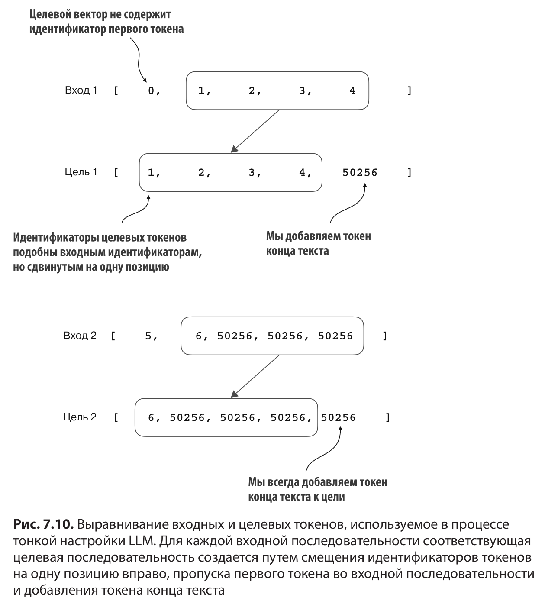
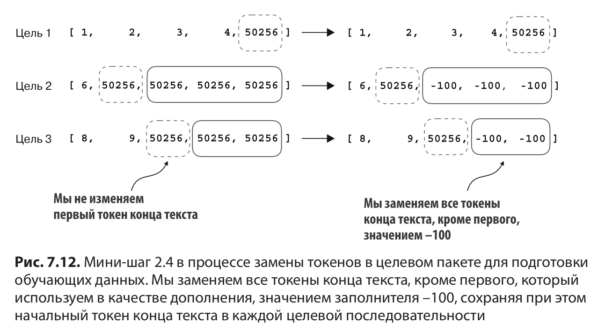
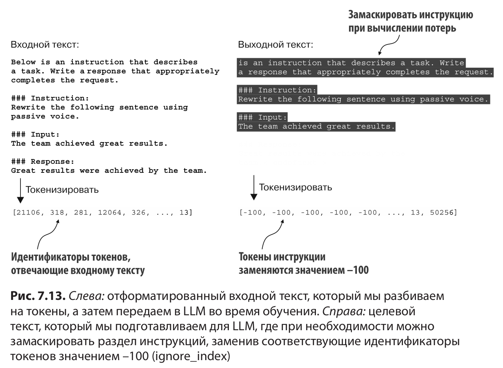

# Глава 7: Тонкая настройка по инструкциям

 

 

### 7.1. Введение в тонкую настройку по инструкциям

 

 

### 7.2. Подготовка набора данных для контролируемой тонкой настройки по инструкциям

 

Набор данных, который мы будем загружать и форматировать, состоит из 1100 пар «инструкция — ответ»

 

 

В оставшейся части этой главы используется стиль подсказок Alpaca

 

### 7.3. Организация данных в обучающие пакеты

 

 

 

 

 

 

 

### 7.4. Создание загрузчиков данных для набора инструкций

 

### 7.5. Загрузка предварительно обученной LLM

 

### 7.6. Тонкая настройка LLM по инструкциям

 

### 7.7. Извлечение и сохранение ответов

 

### 7.8. Оценка точно настроенной LLM

Мы реализуем метод автоматизации оценки ответов модели с помощью другой, более крупной LLM Llama 3 с 8 млрд параметров.
