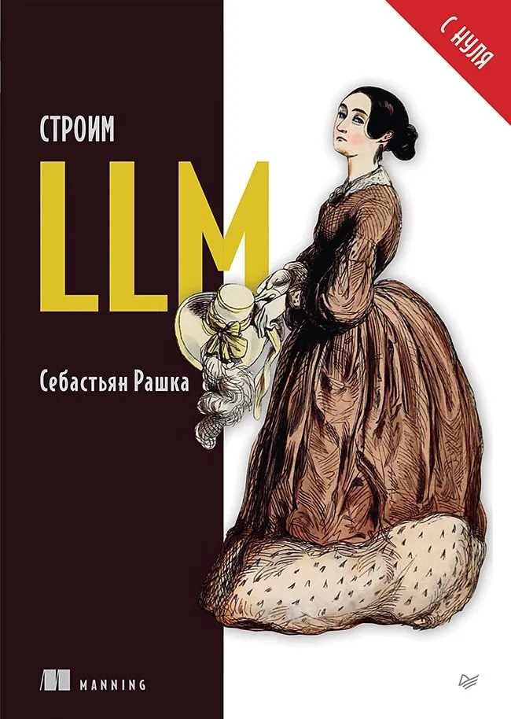
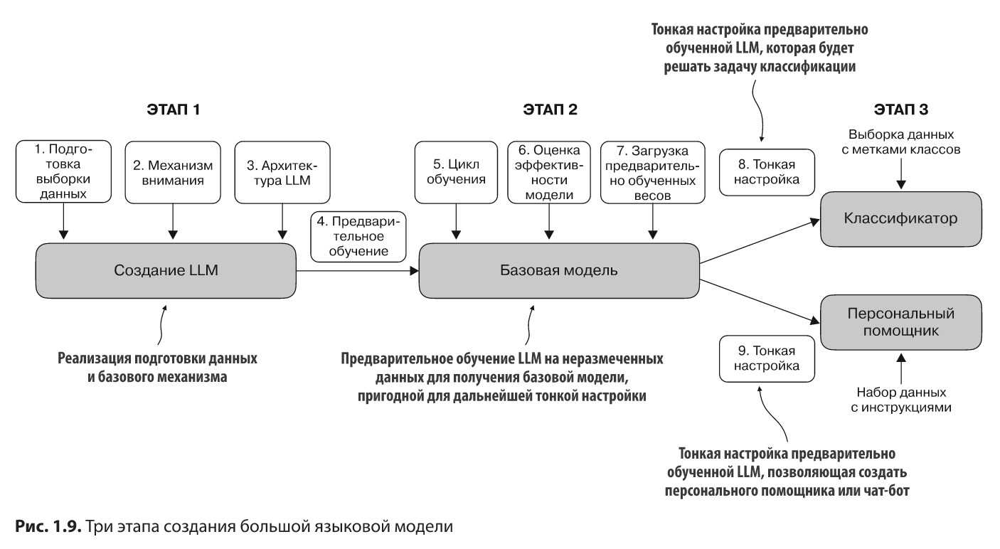

# [Книга][Рашка С.] Строим LLM с нуля [RUS, 2025]

**Оригинальные искодные коды:**  
https://github.com/rasbt/LLMs-from-scratch

 

## Оглавление:

<ol>
  <li>✅ Знакомство с большими языковыми моделями</li>
  <li>✅ Работа с текстовыми данными</li>
  <li>Программирование механизмов внимания</li>
  <li>Создание GPT-подобной модели для генерации текста с нуля</li>
  <li>Предварительное обучение на неразмеченных данных</li>
  <li>Тонкая настройка по классификации</li>
  <li>Тонкая настройка по инструкциям</li>
</ol>

 

